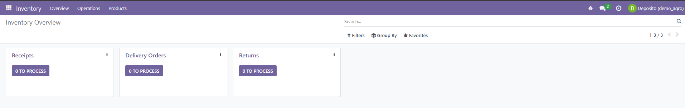
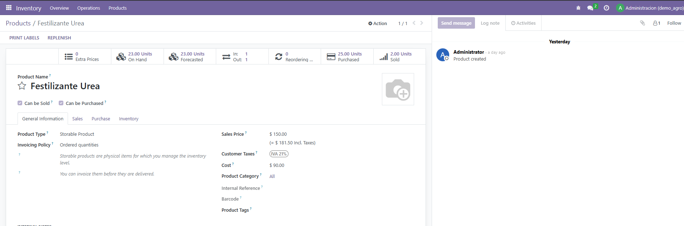
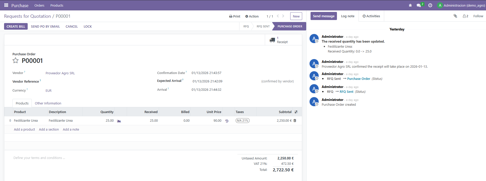
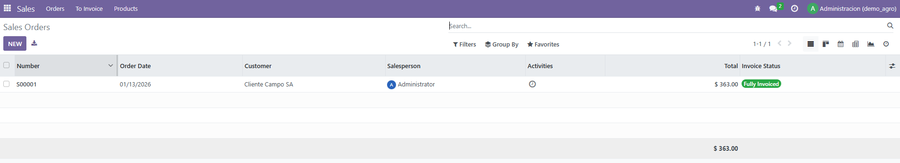
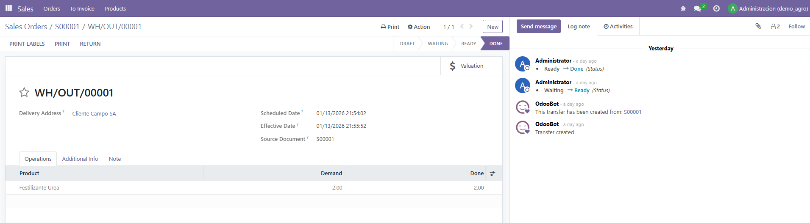

# Evidencia – Demo Funcional Odoo

Las siguientes capturas muestran el flujo funcional implementado
y la configuración de roles en Odoo Community.

---

## 01 – Usuario Depósito
Usuario operativo con acceso exclusivo a Inventario.

---

## 02 – Producto con Stock
Producto almacenado con stock disponible en tiempo real.

---

## 03 – Orden de Compra
Orden de compra validada y recepción confirmada.

---

## 04 – Orden de Venta y Entrega
Orden de venta confirmada con entrega asociada.

---

## 05 – Entrega Validada
Salida de mercadería confirmada desde Inventario.

